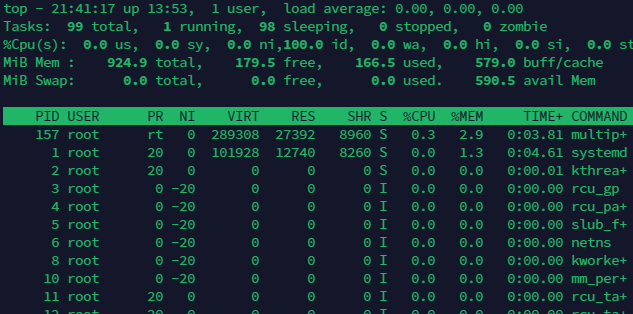

# LinuxPracticeProjects
A Repository for my LinuxProject
## sudo command
This is the short command for superuserdo. It allows one perform task that require administrative or root permission
- Syntax:
sudo (command e.g apt upgrade)

- sudo apt upgrade

## pwd
This command  means present working directory. This command return the full current path. it accepts 2 options -L or -logical prints environment variable contend, including symbolic links.
-P or -physical prints the actual path of the current directory

- Syntax: pwd [option]

## cd
This allows the user navigate through the Linux files and directories. Your current working directory requires the full path or the directory name. The cd command without and option takes you to the home page, however only users with sudo privileges can execute it

- Syntax: cd CommandsLinux

- Some shortcuts
cd ~[username]goes to another user's home directory
cd.. move one directory up
cd- moves to the previous directory

## ls
This command list files and directories within the system. Running it without a flag returns the  current working directory content
- Syntax ls [option]
- ls /home/ubuntu

- other options include
ls -R, ls -a, ls -lh 

## cat
This command stands for Concatenate, it is one of the most frequently used linux commands. Its function is to list, combine and write file content to standard output

- Syntax: cat [option]

To Merge files and store the output in another file
- cat file1 file2 > file3

To displays content in reverse order
- tac filename.txt 

## cp
This command is used to cope files or directories and their content

To cope one file from the current directory to another directory.
- cp devopsFile /home/ubuntu/WorkSpace

 

 To copy the content of a new file in the same directory to a new directory
 - cp devopsFile devopsFile2

 

 To  copy an entire dirctory, pass the -R flag before typing the source directory, followed by the destination directory
 - cp -R /home/ubuntu/WorkSpace /home/ubuntu/WorkSpace_backup

 

 ## mv
 mv command is used to move and rename files and directories. It dosen't produce an output upon execution

To move a file to a new directory
- mv devops1 /home/ubuntu/WorkSapce_backup

 

 To rename a file
 - mv devops2 devops2_remane

 

 ## mkdir command
 This command is used to create one or multiple directosries at once and set permission for them.

 - syntax :mkdir [option] directory_name

 
  
  To make a directory inside Music Folder
  - mkdir Music/Songs

  

  To create a directory between two existing folders we use the -p or -parents. 
  
 -  For example mkdir -p Music/2020/Songs

  To  create directory with full read, write and execute permissions for all users we use
  
   - mkdir -m777 directory_name

  To Prints a message for each created directory 

  - mkdir -v directory_name

  ## Rmdir command
This command is used to permanently delete an empty directory

## rm Command
The rm command is used to delete files within a directory
 - syntax: rm filename

 

 To delete multiple file
 - syntax: rm filename1 filename2 filename3

 
 
 Some acceptable options include:

 -i prompts system confirmation before deleting a file

 -f allows the system to remove without a confirmation

 -r deletes files and files and directories recursively

 
 ## touch command
 This command allows a user create an empty file
 - syntax: touch filename

 

 ## locate command
 This command is used to create a find a file in the database
 - syntax: locate -i school*note

 

 ## find command
 This command is used to search for files within a specific directory and perform subsequent operations

 -syntax:       find [option] [path] [expression]

 

 Other options include:

 find -name filename.txt: This is used to find files in the current directory
 
 find ./ -type -name diretoryname : This is used to look for directories

 ## grep command
This command is used to look for a word by searching through all the text in a specific file.

- syntax: grep values sql_commands.sh

## df command
This command is used to report the system disk space usage, shown in percentate and kilobyte(KB)

- syntax: df [options] [file]

- options include -m displays information on the file system usage in MBs. df-k displays file system usage in KB. DF -T shows all the file system type in a new column

To see the current directory system disk space usage in a human-readable format
- df -h

## du command

This command is used to check how much space a file of a directory takes up. Note that the directory path must be specified 

- syntax :du [option]filepath

Some of the options include: -s which offers the total size of a specified folder, -m provides folder and file information in MB, -K displays information in KB, -h informs the last modification date of the displayed folders and files

## head
This command is used to view the first ten lines of a text in a file. To change the number of files shown we include an option

- syntax:head [option] [file]

The image shows the option -n in use

## tail
This command displays the last ten lines of a file. It allows the user to check if a file has new records or if there is an error message

- syntax : tail [option] [file]

## diff 
This command compares the two contents of a file line by line, after the analyzes it displays the one that do not match. This command is used by programmers to alter a program instead of rewriting the entire sourc code

- syntax: diff [option] file1 file 2

Some of the accepted options include -c which displays the difference between two files in a context form, -u displays the output without redundant infromation, -i makes the diff command case insensitive

## tar 
This command archives multiple files into a TAR FILE. This is similar to ZIP  but has optional compression.

- syntax: tar [options] [archive_file] [file or directory to be archived].

It also accepts options such as: -s extracts a file, -t lists the content of a file , -u archives and adds to an existing archive file

# File Permissions and Ownership

## chmod
This command is used to modiy a file or directory's read, write and execute permissions. Each file in Linux is associated with three user classes: owner, group member and others

- syntax: chmod [option] [permission] [file_name]

It supported options include -c or -changes which displays information when a change is made. -f or -silent suppresses the error messages, -v or -verbose displays a diagnostic for each processed file

## chown

This command allows change of ownership of a file, directory, or symbolic link to a specified username

- syntax : chown [option] owner[:group] file(s)

## jobs
The shell starts the job process. This command displays all the running process along with their status. It only available in csh, bash, tcsh and ksh shells

- syntax: jobs [options] jobID

## kill
This command is used to terminate an unresponsive program manually. A user must first indentiy the process identification number(PID) before killing the program

- syntax:ps ux

## ping
This command is used to check if a network or server is reachable. It is used to troubleshoot various connectivity issues

- syntax: ping [option] [hostname_or_IP_address]

- Example: ping google.com

## wget
This allows one download files for the from internet. It works indpendently without hindering other processes

- syntax : wget [options][url]

- example:wget https://wordpress.org/latest.zip

## uname
This means uname or unix name. This command print detailed information about the Linux system and hardware. Information printed includes machine name, operating system and kernel.

- syntax: uname [option]

Options include -a which prints all the system information, -s which prints the kernel name and -n which prints the system's node hostname

## top
Displays all the running process and a dynamic real time view of the current system. It helps the user identity and terminate a process that may use too much system resources

- syntax:top

## history
Users with sudo privileges can execute this command. The history command enables the system to list up to 500 previously executed commands, this allows you to reuse the command withour re-entering it.

history [option]

## man
It provides a user manual of any commands or utilities, including the name description and options

- syntax : man [command_name]

- Example:man ls

It consist of nine sections section. if you want the specified section to show use this 
- syntax
man [option] [section_number] [command_name]

Example: man 2 ls

## echo
This command is a built-in utility that displays a line of text or string using the standard output

- syntax: echo [option] [string]

## zip, unzip commands
The zip command to compress your files into a ZIP file.

- syntax: zip [options] zipfile file1 file2….

The unzip a file  extracts the zipped files from an archive. 

- syntax: unzip [option] file_name.zip

## hostname
The command is used to know the system's hostname. it can be executed with or without option

- syntax:hostname [option]

The optional flags to use -a or -alias displays. -A of -all-fqdns displays the machine Fully Qualified Domain Name (fQDN). -i or -ip address displays the machine's IP address.

Example: hostname -i

## useradd,userdel
useradd is used to create a new account, while the passwd is used to add password. You must have root privileges to run the command.

The useradd command performs some major changes: Edits the /etc/passwd, /etc/shadow, /etc/group, and /etc/gshadow files for the newly created accounts.  Creates and populates a home directory for the user.  Sets file permissions ownerships to the home directory.

- Syntax: useradd [option] username

- To set the password: passwd the_password_combination

useradd Okaja

passwd changeme

userdel Okaja

## apt-get
This command is used for handling Advanced Package Tool libraries in Linux. It lets you retrieve information and bundles from authenticated sources to manage, update, remove, and install sofware and its dependencies.  To run this command you must use the sudo or root privileges

- syntax : apt-get [options] (command)
 
The most common options are update syncronizes the package files from their sources. update installs the lastest version of all installed packages, It also checks, updates the package cache and checks broken dependencies

[apt-get](./img/ap)

## nanao,vi,jed
This are text editors that is used to manage file. Nano and vi comes with the operating system while jed is installed

The nano command  denotes keywords 

- syntax: nano [filename]

The vi uses operating modes to work - insert and command. Insert is used to edit and create text file. The command performs operation such as saving, opening, copyin and pasting file

- syntax: vi [filename]

## alias
This command allows users create shortcut with the same functionality as the command, file name or text. On executionn, it instructs the shell to replace one string with another

- syntax: unalias [alias_name]

- Example:
 alias Name=String

 alias k=’kill’

 

 ## su
 This is also known as switch user. This allows users run a program as a different user.

 - Syntax: su [options] [username] [argument]

 ## htop
 This command is an interactive program that monitors system resources and server proceses in real time.
 Though its avaliable in most Linux distributions, it can be installed using the default package manager

 - Syntax: htop [options]

 options include -d or -delay shows the delay between updates in tenths of seconds, -C or -no-color enables the monochrome mode. -h or -help displays the help message and exit

 

 ## ps
 This shows the a snapshot of all running process in your system.
 Some of the acceptable  options include: -T displays all process associated with the current shell session. -username list processes associated with a specific user. -A or -e shows all the running processes

